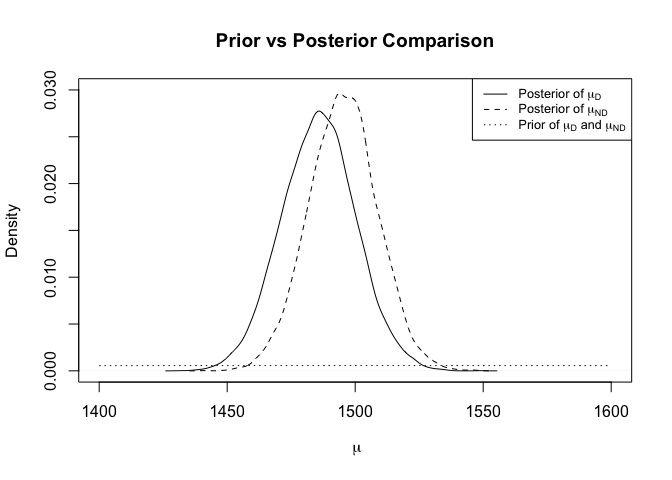

## Introduction

Alzheimer’s is a brain disease where cells degenerate and cause memory
loss. 40 million people worldwide suffer from this disease without an
existing cure. Although there is no definitive cause of Alzheimer’s,
some specialists have found that the smaller the brain, the more prone
an individual may be to cognitive atrophy leading to diseases such as
Alzheimer’s (cite). The total intracranial volume (TIV) is a way to
quantify the size of the brain. TIV includes the volume of the cranium,
brain, and spinal fluid. Our question of interest is do those with
Alzheimer’s have a smaller total intracranial volume than those without
Alzheimer’s? To explore this question, we compare the average TIV for
patients with and without Alzheimer’s. Our patient population is also
restricted to patients ages 60 and older. Our parameter of interest is
the average TIV for patients with and without Alzheimer’s.

## Methods

<div class="figure" style="text-align: center">


<p class="caption">
Histograms of TIV for Alzheimer’s patients in cm cubed.
</p>

</div>

Figure 1 above illustrates the estimated TIV measurements for demented
and non-demented groups. We see that these values have a uniform and
bell-shaped distribution. Therefore, we choose a normal distribution
with parameters *μ* and *σ*<sup>2</sup> as the likelihood to model our
data. Our likelihood is listed below.

We assume that the prior parameter *μ* is normally distributed. We set
this prior distribution because *μ* represents the average TIV for both
populations and averages can be normally distributed. We also assume
that the variance denoted by *σ*<sup>2</sup> follows an inverse gamma
distribution because the variance of TIV for both populations is
positive and right-skewed. We assume the prior distributions for both
the demented (D) and non-demented (N) populations to be the same. The
distributions of the prior distributions for our parameters are listed
below.

To choose the prior parameters for *μ*, we chose a reasonable value for
the prior mean, 1500. We chose and an uninformative variance of 500000
for our mean due to our inexpertise regarding Alzheiemer’s. To choose
the prior parameters for *σ*<sup>2</sup>, which follows an inverse gamma
distribution, we used uninformative parameter values of 2 for both *γ*
and *ϕ*. We assume the prior distribution for *μ* and *σ*<sup>2</sup>
are the same for both the demented and non-demented groups. Figure 2
illustrates our prior distributions.

<div class="figure" style="text-align: center">


<p class="caption">
Prior distribution for the TIV measurement for a randomly selected
patient.
</p>

</div>

We analyze a data set taken from Kaggle that includes data from a
sampled set of patients 60 years and older. Metrics collected on these
individuals include whether they have Alzheimer’s (our two groups),
gender, age, education level, TIV measurements (our explanatory
variable), and other physiological characteristics. To be clear, we are
referring to Alzheimer’s patients as all patients in the study, this
includes two groups of interest, those who have Alzheimer’s (demented)
and those who do not (non-demented). Table 1 shows summary statistics of
TIV for demented and non-demented patients that were taken from our
data.

|        | Demented | Non-Demented |
|:-------|---------:|-------------:|
| Min    |     1143 |         1106 |
| Q1     |     1357 |         1358 |
| Median |     1476 |         1474 |
| Mean   |     1485 |         1495 |
| Q3     |     1566 |         1634 |
| Max    |     1957 |         2004 |

Patient TIV Summary Statistics

## Results

We use our likelihood, prior distributions and Gibbs sampling to
investigate the difference in the average of TIV for demented and
non-demented patients. We use Gibbs sampling specifically to approximate
a posterior distribution for both populations *μ* and *σ*<sup>2</sup>.

Figure 3 plots the posterior distributions for our parameters *μ* and
*σ*<sup>2</sup> for demented and non-demented patients. The posterior
mean and variance for TIV for demented patients are 1485.7665 and
2.9704186^{4} (with standard deviation of 172.0659) respectively. The
mean and variance of our posterior distribution for non-demented
patients are 1495.2329 and 3.3760544^{4} (with standard deviation of
183.5044) respectively.

<div class="figure" style="text-align: center">


<p class="caption">
Posterior distribution for the average TIV measurement of patients with
(top row) and without (bottom row) Alzheimer’s.
</p>

</div>

We conducted this analysis to understand the difference between the
average TIV of patients with and without Alzheimer’s. In Figure 5, we
plot the posterior distribution of the difference in average TIV between
demented and non-demented patients. We see that the mean of this
distribution is -9.466. This means that on average, the demented
patients have 9.466 cm<sup>3</sup> less total intracranial volume than
non-demented patients. This supports our hunch that Alzheimer’s erodes
away brain matter thus patients with this disease may have smaller TIV.
The 95% credible interval of this distribution is between -47.7 and
28.8. Because this credible interval contains zero, however, we conclude
that these results are not significant and we cannot confidently say
that those with Alzheimer’s have significantly smaller TIV than those
without Alzheimer’s.

<div class="figure" style="text-align: center">


<p class="caption">
Posterior distribution for the difference in average TIV measurements
between patients with and without Alzheimers.
</p>

</div>

## Conclusion

In this analysis, we wanted to investigate whether patients with
Alzheimer’s have smaller TIV than those who do not have Alzheimer’s. Our
results show that the average TIV of patients who have Alzheimer’s is
9.466 cm<sup>3</sup> less TIV than those who do not have Alzheimer’s.
However, our results show that this conclusion was insignificant.

As the Prior vs Posterior Comparison plot below shows, our knowledge
beforehand covered a very wide range and had little probability mass
where the posterior distribution lies. The data changed our knowledge
drastically and has given us more information about the TIV measurements
in those 60 years and older with and without Alzheimer’s.

<div class="figure" style="text-align: center">


<p class="caption">
Prior vs Posterior Comparison.
</p>

</div>

Because our results are insignificant, we feel that it would be
irresponsible to present a posterior predictive distribution. There is a
1800 cm<sup>3</sup> range of normal TIV measurement values that an
individual may have. Because an estimated total intracranial volume is
so variable from person to person, we wish to not alarm the public over
insignificant results. For example, a random person with a smaller TIV
measurement, may or may not have Alzheimer’s. Because our difference in
averages are insignificant, a prediction like this would be even more
insignificant.

A new question we are interested in is how brain size changes by age
between those people developing and not developing Alzheimer’s. This may
be useful in detecting if one may be more likely to develop Alzheimer’s
according to their age. Another question for further research is: how
quickly does Alzheimer’s erase one’s memory? Is there a difference in
this speed between those diagnosed with early-onset Alzheimer’s and
those diagnosed with late-onset Alzheimer’s? These would be interesting
questions to consider in future analyses in order to better understand
this disease.

## Appendix

``` r
knitr::opts_chunk$set(echo=FALSE, warning=FALSE, message=FALSE)

# libraries
library(tidyverse)
library(invgamma)
library(latex2exp)
library(cowplot)

# set seed
set.seed(1234)
# filepath <- paste0('~/Documents/Winter 2022/Stat251/alzheimer.csv')
filepath <- 'alzheimer.csv'
alz <- read.csv(filepath, stringsAsFactors = TRUE)

# measurements of total intracranial volume
demented <- alz %>% filter(Group == 'Demented')
nondemented <- alz %>% filter(Group == 'Nondemented')

par(mfrow = c(1, 2))

# histogram for demented patients
ggplot(demented, aes(x = eTIV)) +
  geom_histogram() +
  theme_bw() +
  theme(panel.grid = element_blank()) +
  scale_y_continuous(expand = c(0, 0), limits = c(0, 23)) +
  labs(title = 'Histogram of TIV for Demented Patients',
       x = 'TIV',
       y = 'Patient Count')

# histogram for nondemented patients
ggplot(nondemented, aes(x = eTIV)) +
  geom_histogram() +
  theme_bw() +
  theme(panel.grid = element_blank()) +
  scale_y_continuous(expand = c(0, 0), limits = c(0, 20)) +
  labs(title = 'Histogram of TIV for Non-demented Patients',
       x = 'TIV',
       y = 'Patient Count')
# prior for mu
prior_mean <- 1500 # lambda
# prior_var <- 1000 # tau^2
prior_var <- 500000 # tau^2

# prior for sigma2
prior_gamma <- 2
prior_phi <- 2

# par(mfrow = c(1,2))

# plot prior distribution of mu
curve(dnorm(x, prior_mean, sqrt(prior_var)),
      xlim = c(-2000, 5000),
      main = 'Prior Distribution of' ~mu,
      xlab = ~mu,
      ylab = 'Density')

# plot prior distribution of sigma2
curve(dinvgamma(x, prior_gamma, prior_phi), xlim = c(0, 10),
      main = 'Prior Distribution of' ~sigma^2,
      xlab = ~sigma^2,
      ylab = 'Density')
# summaries of data
dem_stat <- as.integer(summary(demented$eTIV))
nondem_stat <- as.integer(summary(nondemented$eTIV))

row_names <- c('Min', 'Q1', 'Median', 'Mean', 'Q3', 'Max')

alz_stat <- as.data.frame(cbind(dem_stat, nondem_stat),
              row.names = row_names)
colnames(alz_stat) <- c('Demented', 'Non-Demented')

knitr::kable(
  alz_stat,
  col.names = c('Demented', 'Non-Demented'),
  digits = 3,
  caption = 'Patient TIV Summary Statistics'
)
# set data
demented <- alz %>% filter(Group == 'Demented') %>% select(eTIV)
n <- nrow(demented)

# set prior parameters for mu
lambda <- prior_mean
tau2 <- prior_var 

# set prior parameters for sigma2
gamma <- prior_gamma
phi <- prior_phi

# set starting values for Gibbs sampling
mu <- 1500
sigma2 <- 1

# initializations for the Gibbs Sampling Algorithm
iters <- 10000
mu_save <- rep(0, iters)
sigma2_save <- rep(0, iters)

mu_save[1] <- mu
sigma2_save[1] <- sigma2

# Gibbs Sampling Algorithm
for(t in 2:iters){
  
  # full conditional of mu (update the value of the parameters)
  lambda_p <- (tau2*sum(demented) + sigma2*lambda) / (tau2*n + sigma2) 
  tau2_p <- sigma2*tau2 / (tau2*n + sigma2) # posterior variance
  
  # sample a new value of mu from its full conditional
  mu <- rnorm(1, lambda_p, sqrt(tau2_p))
  
  # save the value of mu
  mu_save[t] <- mu
  
  # full conditional of sigma2 (update the value of the parameters)
  gamma_p <- gamma + n/2
  phi_p <- phi + sum((demented - mu)^2)/2
  
  # sample new value of sigma2 from its full conditional
  sigma2 <- rinvgamma(1, gamma_p, phi_p)
  
  # save the value of sigma2
  sigma2_save[t] <- sigma2
}

# trace plots to determine burn-in
plot(mu_save, type='l')
plot(sigma2_save, type='l')

# throw out the first few values
burn <- 100
mu_use_demented <- mu_save[-(1:burn)]
sigma2_use_demented <- sigma2_save[-(1:burn)]
plot(mu_use_demented, type='l')
plot(sigma2_use_demented, type='l')
# set data
nondemented <- alz %>% filter(Group == 'Nondemented') %>% select(eTIV)
n <- nrow(nondemented)

# set prior parameters for mu
lambda <- prior_mean
tau2 <- prior_var

# set prior for sigma2
gamma <- prior_gamma
phi <- prior_phi

# set starting values for Gibbs sampling
mu <- 1500
sigma2 <- 1

# initializations for the Gibbs Sampling Algorithm
iters <- 10000
mu_save <- rep(0, iters)
sigma2_save <- rep(0, iters)

mu_save[1] <- mu
sigma2_save[1] <- sigma2

# Gibbs Sampling Algorithm
for(t in 2:iters){
  
  # full conditional of mu (update the value of the parameters)
  lambda_p <- (tau2*sum(nondemented) + sigma2*lambda)/(tau2*n + sigma2)
  tau2_p <- sigma2*tau2/(tau2*n + sigma2)
  
  # sample a new value of mu from its full conditional
  mu <- rnorm(1, lambda_p, sqrt(tau2_p))
  
  # save the value of mu
  mu_save[t] <- mu
  
  # full conditional of sigma2 (update the value of the parameters)
  gamma_p <- gamma + n/2
  phi_p <- phi + sum((nondemented - mu)^2 )/2
  
  # sample new value of sigma2 from its full conditional
  sigma2 <- rinvgamma(1, gamma_p, phi_p)
  
  # save the value of sigma2
  sigma2_save[t] <- sigma2
}

# trace plots to determine burn-in
plot(mu_save, type='l')
plot(sigma2_save, type='l')

# throw out the first few values
burn <- 100
mu_use_nondemented <- mu_save[-(1:burn)]
sigma2_use_nondemented <- sigma2_save[-(1:burn)]
plot(mu_use_nondemented, type='l')
plot(sigma2_use_nondemented, type='l')

par(mfrow = c(2, 2))

# marginal posterior distribution of mu (NOT conditional on sigma2)
plot(density(mu_use_demented), 
     xlim=c(1400, 1600),
     # xlim=c(-1000, 4000),
     xlab = ~mu,
     ylab = "Density", 
     main = expression(pi(mu~"|"~data)))

# marginal posterior distribution of sigma2 (NOT conditional on mu)
plot(density(sigma2_use_demented),
     # xlim = c(0, 200),
     # ylim = c(0.000000002, 0.000000004),
     xlab = ~sigma^2,
     ylab = "Density", 
     main = expression(pi(sigma^2~"|"~data)))

# marginal posterior distribution of mu
plot(density(mu_use_nondemented), 
     xlab = ~mu, 
     ylab = "Density", 
     main = expression(pi(mu~"|"~data)))

# marginal posterior distribution of sigma2
plot(density(sigma2_use_nondemented),
     xlab = ~sigma^2,
     ylab = "Density",
     main = expression(pi(sigma^2~"|"~data)))

# take difference between distribution
d <- mu_use_demented - mu_use_nondemented

# plot posterior distribution in difference of means
plot(density(d), 
     xlim = c(-100, 100), 
     xlab = TeX("Posterior of $mu_D - mu_N$"),
     ylab = "Density",
     main = 'Posterior Distribution of Difference in Means')
abline(v = mean(d), lty = 'dashed')

# 95% credible interval
quant <- quantile(d, c(.025, .975)) 
# The difference between TIV size between demented and 
# nondemented is insignificant since our credible interval contains 0.
## posterior predictive

# posterior predictive for both populations
dem_postpred <- rnorm(100000, 
                      mu_use_demented, 
                      sqrt(sigma2_use_demented))
nondem_postpred <- rnorm(100000, 
                         mu_use_nondemented, 
                         sqrt(sigma2_use_nondemented))

# plot the posterior predictive for both populations
plot(density(dem_postpred),
     xlim = c(500, 2500),
     main = "Posterior Predictive Distribution for Patients With Alzheimer's",
     xlab = 'TIV')
plot(density(nondem_postpred), xlim = c(500, 2500),
     main = "Posterior Predictive Distribution for Patients Without Alzheimer's",
     xlab = 'TIV')
# marginal posterior distribution of mu_Demented
plot(density(mu_use_demented), 
     xlim=c(1400, 1600),
     ylim=c(0, 0.03),
     xlab = ~mu, 
     ylab = "Density", 
     main = "Prior vs Posterior Comparison")

# marginal posterior distribution of mu_nondemented
lines(density(mu_use_nondemented), lty=2)

curve(dnorm(x, prior_mean, sqrt(prior_var)), add=TRUE, lty = 3) # Prior

legend('topright', 
       legend = c(TeX("Posterior of $mu_D$"), 
                  TeX("Posterior of $mu_{ND}$"), 
                  TeX("Prior of $mu_D$ and $mu_{ND}")),
       lty = c(1, 2, 3),
       cex = 0.8)
```
