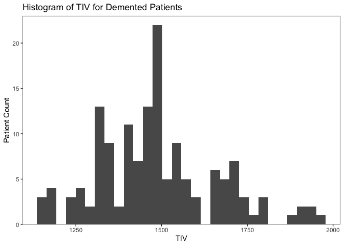
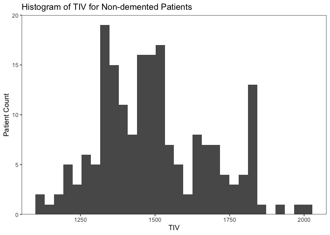
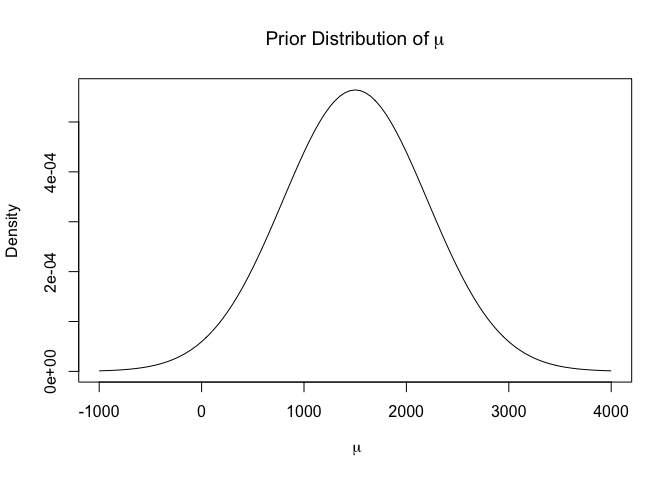
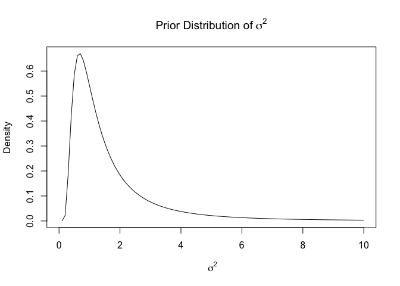
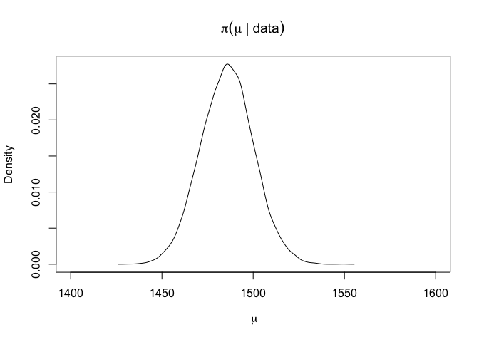
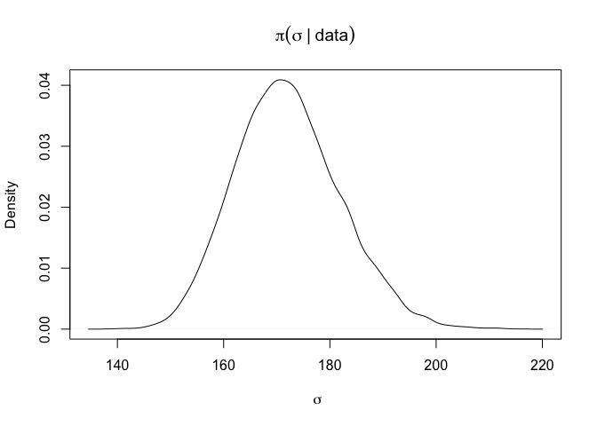
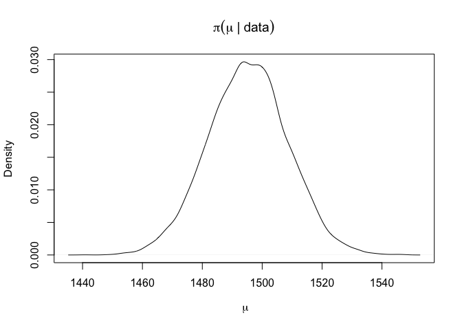
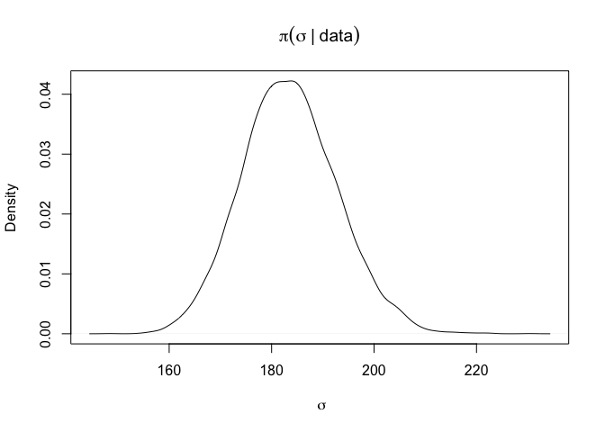
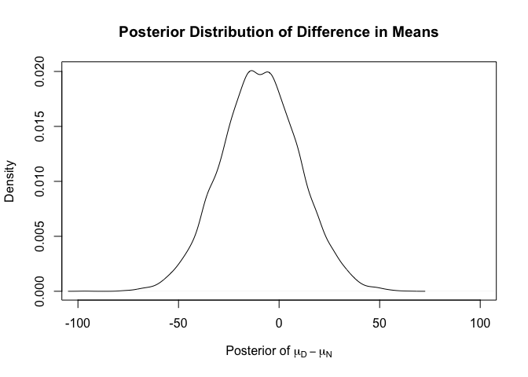
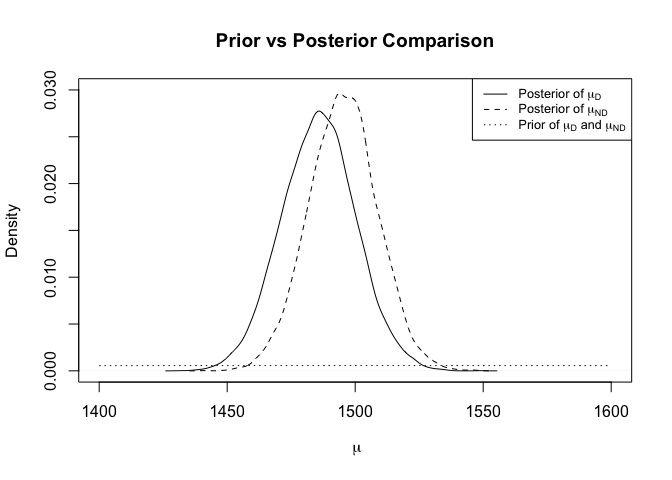

## Introduction

Alzheimer’s is a brain disease where cells degenerate and cause memory
loss. 40 million people worldwide suffer from this disease and a cure
does not exist. Although there is no definitive cause of Alzheimer’s,
scientists speculate that genetics, aging, and environmental influences
may affect the probability of developing the disease. Some specialists
have found that the larger the brain, the more the brain may combat
against the effects of cognitive atrophy. The total intracranial volume
(TIV) is a way to quantify the size of the brain. TIV includes the
volume of the cranium, brain, and spinal fluid. To discover how brain
size relates to Alzheimer’s, we will investigate the average TIV for
patients 60 years and older of those with and without the disease. Do
those with Alzheimer’s have a smaller total intracranial volume than
those without Alzheimer’s? The parameter of interest is the average TIV
for demented and non-demented patients.

In order to investigate this question, we analyzed a dataset taken from
Kaggle that includes data from a sampled set of patients 60 years and
older. Metrics collected on these individuals include whether they have
Alzheimer’s (our two groups), gender, age, education level, TIV
measurements (our explanatory variable), and other physiological
characteristics. To be clear, we are referring to Alzheimer’s patients
as all patients in the study, this includes two groups of interest,
those who are demented and those who are not.

## Methods

Figure 1 is a plot of the estimated TIV measurement for demented and
non-demented groups. We see that these values have a uniform and
bell-shaped distribution therefore, we use a normal distribution with
parameters *μ* and *σ*2 as the likelihood to model our data.
The likelihood model is listed below the plots.

Histograms of TIV for Alzheimers patients in cm cubed.

Likelihood:
*x**i*|*μ*, *σ*2 ∼ *N*(*μ*, *σ*2),  *i* = 1, ...*n*

We assume that the prior parameter *μ* (which represents that average
TIV for both populations), is normally distributed. We also assume that
the variance denoted by *σ*2 follows an inverse gamma
distribution because the variance of TIV for both populations is
positive and right-skewed. The distributions of the prior distributions
for our parameters are listed below. We assume the prior distributions
for both the demented (D) and non-demented (N) populations to be the
same.

To choose the prior parameters for *μ*, we chose a reasonable value for
the prior mean, 1500, and an uninformative, or very large variance,
500000, on that mean because of our inexpertise in the subject. To
choose the prior parameters for *σ*, which follows an inverse gamma
distribution, we used very uninformative parameter values for gamma and
phi, of 2 and 2, respectively.

Prior distribution for the TIV measurement for a randomly selected
patient.

In order to investigate the question, do those with Alzheimer’s have a
different total intracranial volume than those without Alzheimer’s, on
average?, we analyzed a data set taken from Kaggle that includes data
from a sampled set of patients 60 years and older. Metrics collected on
these individuals include whether they have Alzheimer’s (our response
variable), gender, age, education level, TIV measurements (our
explanatory variable), and other physiological characteristics.

<table>
<caption>Patient TIV Summary Statistics</caption>
<thead>
<tr class="header">
<th style="text-align: left;"></th>
<th style="text-align: right;">Demented</th>
<th style="text-align: right;">Non-Demented</th>
</tr>
</thead>
<tbody>
<tr class="odd">
<td style="text-align: left;">Min</td>
<td style="text-align: right;">1143</td>
<td style="text-align: right;">1106</td>
</tr>
<tr class="even">
<td style="text-align: left;">Q1</td>
<td style="text-align: right;">1357</td>
<td style="text-align: right;">1358</td>
</tr>
<tr class="odd">
<td style="text-align: left;">Median</td>
<td style="text-align: right;">1476</td>
<td style="text-align: right;">1474</td>
</tr>
<tr class="even">
<td style="text-align: left;">Mean</td>
<td style="text-align: right;">1485</td>
<td style="text-align: right;">1495</td>
</tr>
<tr class="odd">
<td style="text-align: left;">Q3</td>
<td style="text-align: right;">1566</td>
<td style="text-align: right;">1634</td>
</tr>
<tr class="even">
<td style="text-align: left;">Max</td>
<td style="text-align: right;">1957</td>
<td style="text-align: right;">2004</td>
</tr>
</tbody>
</table>

Patient TIV Summary Statistics

## Results

Because of our likelihood and prior distributions, we can approximate a
posterior distribution for both populations *μ* and *σ*2
using a Gibbs sampler.

Posterior distribution for the average TIV measurement of patients with
Alzheimers.

The mean and variance of our posterior distribution for demented
patients are 1485.7665 and 2.9704186^{4} respectively.

Posterior distribution for the average TIV measurement of patients
without Alzheimers.

The mean and variance of our posterior distribution for demented
patients are 1495.2329 and 3.3760544^{4} respectively.

We conducted this analysis because we wanted to understand if there was
a difference between average TIV measurements of patients with and
without Alzheimer’s. In the plot below (posterior distribution of the
difference in means), we see that the average TIV difference (Demented -
Nondemented) is -9.466. This means that on average, the non-demented
patients have 9.466 *c**m*3 more total intracranial volume
than demented patients. This possibly confirms our hunch that
Alzheimer’s erodes away brain matter. The 95% credible interval of this
distribution is between -47.7 and 28.8. Because this credible interval
contains zero, we conclude that these results are not significant and we
cannot confidently say that those with Alzheimer’s have a smaller TIV
than those without Alzheimer’s.

Posterior distribution for the difference in average TIV measurements
between patients with and without Alzheimers.

## Conclusion

The average difference of means between TIV in patients with and without
Alzheimer’s is -9.466 *c**m*3, which is less than 0. This
means that on average, patients with Alzheimer’s have slightly smaller
TIV than those without Alzheimer’s. However, our results show that this
conclusion was insignificant, because a 95% confidence interval is a
range that covers 0.

As the Prior vs Posterior Comparison plot below shows, our knowledge
beforehand covered a very wide range and had little probability mass
where the posterior distribution lies. The data changed our knowledge
drastically and has given us more information about the TIV measurements
in those 60 years and older with and without Alzheimer’s.

Prior vs Posterior Comparison.

Because our results are insignificant, we feel that it would be
irresponsible to present a posterior predictive distribution. There is a
1800 *c**m*3 range of normal TIV measurement values that an
individual may have. Because an estimated total intracranial volume is
so variable from person to person, we wish to not alarm the public over
insignificant results. For example, A random person with a smaller TIV
measurement, may or may not have Alzheimer’s. Because our difference in
averages are insignificant, a prediction like this would be even more
insignificant.

A new question we are interested in is how brain size changes by age
between those people developing and not developing Alzheimer’s. This may
be useful in detecting if one may be more likely to develop Alzheimer’s.
Another question for further research is: How quickly does Alzheimer’s
erase one’s memory? Is there a difference in this speed between those
diagnosed with early-onset Alzheimer’s and those diagnosed with
late-onset Alzheimer’s?

## Appendix

    knitr::opts_chunk$set(echo=FALSE, warning=FALSE, message=FALSE)

    # libraries
    library(tidyverse)
    library(invgamma)
    library(latex2exp)

    # set seed
    set.seed(1234)
    # filepath <- paste0('~/Documents/Winter 2022/Stat251/alzheimer.csv')
    filepath <- 'alzheimer.csv'
    alz <- read.csv(filepath, stringsAsFactors = TRUE)
    # measurements of total intracranial volume
    demented <- alz %>% filter(Group == 'Demented')
    nondemented <- alz %>% filter(Group == 'Nondemented')

    # histogram for demented patients
    ggplot(demented, aes(x = eTIV)) +
      geom_histogram() +
      theme_bw() +
      theme(panel.grid = element_blank()) +
      scale_y_continuous(expand = c(0, 0), limits = c(0, 23)) +
      labs(title = 'Histogram of TIV for Demented Patients',
           x = 'TIV',
           y = 'Patient Count')

    # histogram for nondemented patients
    ggplot(nondemented, aes(x = eTIV)) +
      geom_histogram() +
      theme_bw() +
      theme(panel.grid = element_blank()) +
      scale_y_continuous(expand = c(0, 0), limits = c(0, 20)) +
      labs(title = 'Histogram of TIV for Non-demented Patients',
           x = 'TIV',
           y = 'Patient Count')
    # prior for mu
    prior_mean <- 1500 # lambda
    prior_var <- 500000 # tau^2

    # prior for sigma2
    prior_gamma <- 2
    prior_phi <- 2

    # plot prior distribution of mu
    curve(dnorm(x, prior_mean, sqrt(prior_var)), 
          xlim = c(-1000, 4000),
          main = 'Prior Distribution of' ~mu,
          xlab = ~mu,
          ylab = 'Density')

    # plot prior distribution of sigma2
    curve(dinvgamma(x, prior_gamma, prior_phi), xlim = c(0, 10),
          main = 'Prior Distribution of' ~sigma^2,
          xlab = ~sigma^2,
          ylab = 'Density')
    # summaries of data
    dem_stat <- as.integer(summary(demented$eTIV))
    nondem_stat <- as.integer(summary(nondemented$eTIV))

    row_names <- c('Min', 'Q1', 'Median', 'Mean', 'Q3', 'Max')

    alz_stat <- as.data.frame(cbind(dem_stat, nondem_stat),
                  row.names = row_names)
    colnames(alz_stat) <- c('Demented', 'Non-Demented')

    knitr::kable(
      alz_stat,
      col.names = c('Demented', 'Non-Demented'),
      digits = 3,
      caption = 'Patient TIV Summary Statistics'
    )

    # alz_stat %>% kableExtra::kbl(caption = 'Patient TIV Summary Statistics') %>%
    #   kableExtra::kable_classic(full_width = FALSE, html_font = 'Cambria')
    # set data
    demented <- alz %>% filter(Group == 'Demented') %>% select(eTIV)
    n <- nrow(demented)

    # set prior parameters for mu
    lambda <- prior_mean
    tau2 <- prior_var 

    # set prior parameters for sigma2
    gamma <- prior_gamma
    phi <- prior_phi

    # set starting values for Gibbs sampling
    mu <- 1500
    sigma2 <- 1

    # initializations for the Gibbs Sampling Algorithm
    iters <- 10000
    mu_save <- rep(0, iters)
    sigma2_save <- rep(0, iters)

    mu_save[1] <- mu
    sigma2_save[1] <- sigma2

    # Gibbs Sampling Algorithm
    for(t in 2:iters){
      
      # full conditional of mu (update the value of the parameters)
      lambda_p <- (tau2*sum(demented) + sigma2*lambda) / (tau2*n + sigma2) 
      tau2_p <- sigma2*tau2 / (tau2*n + sigma2) # posterior variance
      
      # sample a new value of mu from its full conditional
      mu <- rnorm(1, lambda_p, sqrt(tau2_p))
      
      # save the value of mu
      mu_save[t] <- mu
      
      # full conditional of sigma2 (update the value of the parameters)
      gamma_p <- gamma + n/2
      phi_p <- phi + sum((demented - mu)^2)/2
      
      # sample new value of sigma2 from its full conditional
      sigma2 <- rinvgamma(1, gamma_p, phi_p)
      
      # save the value of sigma2
      sigma2_save[t] <- sigma2
    }

    # trace plots to determine burn-in
    plot(mu_save, type='l')
    plot(sigma2_save, type='l')

    # throw out the first few values
    burn <- 100
    mu_use_demented <- mu_save[-(1:burn)]
    sigma2_use_demented <- sigma2_save[-(1:burn)]
    plot(mu_use_demented, type='l')
    plot(sigma2_use_demented, type='l')
    ## plotting posterior distribution for demented

    # marginal posterior distribution of mu (NOT conditional on sigma2)
    plot(density(mu_use_demented), xlim=c(1400, 1600), 
         xlab = ~mu, 
         ylab = "Density", 
         main = expression(pi(mu~"|"~data)))

    # marginal posterior distribution of sigma2 (NOT conditional on mu)
    # plot(density(sigma2_use_demented), 
    #      # xlim = c(0, 1000),  
    #      # ylim = c(0.000000002, 0.000000004),
    #      xlab=expression(sigma^2), 
    #      ylab="Density", main=expression(pi(sigma^2~"|"~data)))

    # marginal posterior distribution of sigma (NOT conditional on mu)
    plot(density(sqrt(sigma2_use_demented)), 
         xlab = ~sigma, 
         ylab = "Density", 
         main = expression(pi(sigma~"|"~data)))
    # set data
    nondemented <- alz %>% filter(Group == 'Nondemented') %>% select(eTIV)
    n <- nrow(nondemented)

    # set prior parameters for mu
    lambda <- prior_mean
    tau2 <- prior_var

    # set prior for sigma2
    gamma <- prior_gamma
    phi <- prior_phi

    # set starting values for Gibbs sampling
    mu <- 1500
    sigma2 <- 1

    # initializations for the Gibbs Sampling Algorithm
    iters <- 10000
    mu_save <- rep(0, iters)
    sigma2_save <- rep(0, iters)

    mu_save[1] <- mu
    sigma2_save[1] <- sigma2

    # Gibbs Sampling Algorithm
    for(t in 2:iters){
      
      # full conditional of mu (update the value of the parameters)
      lambda_p <- (tau2*sum(nondemented) + sigma2*lambda)/(tau2*n + sigma2)
      tau2_p <- sigma2*tau2/(tau2*n + sigma2)
      
      # sample a new value of mu from its full conditional
      mu <- rnorm(1, lambda_p, sqrt(tau2_p))
      
      # save the value of mu
      mu_save[t] <- mu
      
      # full conditional of sigma2 (update the value of the parameters)
      gamma_p <- gamma + n/2
      phi_p <- phi + sum((nondemented - mu)^2 )/2
      
      # sample new value of sigma2 from its full conditional
      sigma2 <- rinvgamma(1, gamma_p, phi_p)
      
      # save the value of sigma2
      sigma2_save[t] <- sigma2
    }

    # trace plots to determine burn-in
    plot(mu_save, type='l')
    plot(sigma2_save, type='l')

    # throw out the first few values
    burn <- 100
    mu_use_nondemented <- mu_save[-(1:burn)]
    sigma2_use_nondemented <- sigma2_save[-(1:burn)]
    plot(mu_use_nondemented, type='l')
    plot(sigma2_use_nondemented, type='l')
    ## posterior distribution of non-demented

    # marginal posterior distribution of mu
    plot(density(mu_use_nondemented), 
         xlab = ~mu, 
         ylab = "Density", 
         main = expression(pi(mu~"|"~data)))

    # marginal posterior distribution of sqrt(sigma2) (standard deviation)
    plot(density(sqrt(sigma2_use_nondemented)), 
         xlab = ~sigma, 
         ylab = "Density", 
         main = expression(pi(sigma~"|"~data)))

    # take difference between distribution
    d <- mu_use_demented - mu_use_nondemented

    # plot posterior distribution in difference of means
    plot(density(d), 
         xlim = c(-100, 100), 
         xlab = TeX("Posterior of $mu_D - mu_N$"),
         ylab = "Density",
         main = 'Posterior Distribution of Difference in Means')

    # measure the mean of the distribution
    postdiff_mu <- mean(d)

    # 95% credible interval
    quant <- quantile(d, c(.025, .975)) 
    # The difference between TIV size between demented and 
    # nondemented is insignificant since our credible interval contains 0.
    ## posterior predictive

    # posterior predictive for both populations
    dem_postpred <- rnorm(100000, 
                          mu_use_demented, 
                          sqrt(sigma2_use_demented))
    nondem_postpred <- rnorm(100000, 
                             mu_use_nondemented, 
                             sqrt(sigma2_use_nondemented))

    # plot the posterior predictive for both populations
    plot(density(dem_postpred),
         xlim = c(500, 2500),
         main = "Posterior Predictive Distribution for Patients With Alzheimer's",
         xlab = 'TIV')
    plot(density(nondem_postpred), xlim = c(500, 2500),
         main = "Posterior Predictive Distribution for Patients Without Alzheimer's",
         xlab = 'TIV')
    # marginal posterior distribution of mu_Demented
    plot(density(mu_use_demented), xlim=c(1400, 1600), ylim=c(0, 0.03),
         xlab = ~mu, 
         ylab = "Density", 
         main = "Prior vs Posterior Comparison")

    # marginal posterior distribution of mu_NonDemented
    lines(density(mu_use_nondemented), lty=2)

    curve(dnorm(x, prior_mean, sqrt(prior_var)), add=T, lty = 3) # Prior

    legend('topright', 
           legend = c(TeX("Posterior of $mu_D$"), 
                      TeX("Posterior of $mu_{ND}$"), 
                      TeX("Prior of $mu_D$ and $mu_{ND}")),
           lty = c(1, 2, 3),
           cex = 0.8)
